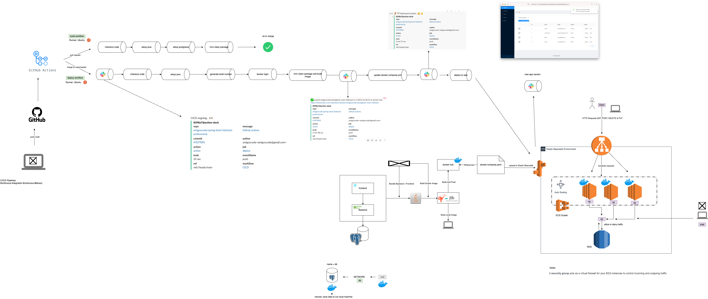

# Description

Building a full stack application that touches on the following import concepts:

* `Spring Boot` Backend API
* Frontend with `React` Hooks and Functions Components
* `Maven` Build Tool
* Databases using `Postgres` on `Docker`
* `Spring Data JPA`
* Server and Client Side Error Handling
* `Packaging applications` for deployment using Docker and Jib
* `AWS RDS & Elastic Beanstalk`
* `Software Deployment Automation` with `Github Actions`
* `Software Deployment Monitoring` with Slack
* Unit and Integration `Testing`

## Diagram

